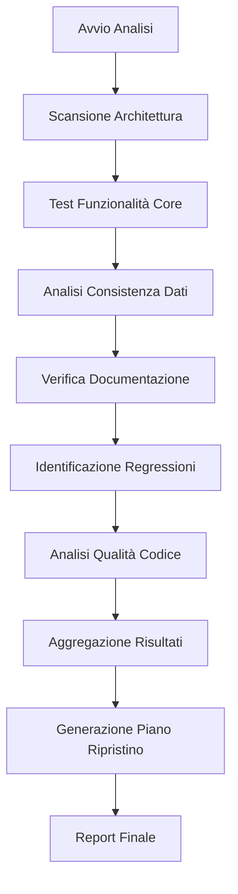

# Design Document - Analisi Microscopica The Safe Place

## Overview

Questo documento descrive il design per un sistema di analisi microscopica completa del progetto "The Safe Place" v0.6.4. Il sistema sarà progettato per eseguire un'ispezione approfondita di tutti gli aspetti del progetto: architettura, funzionalità, qualità del codice, consistenza dei dati, e stato delle implementazioni.

L'analisi seguirà un approccio strutturato e metodico, utilizzando sia analisi automatizzata che verifica manuale, per produrre un piano di ripristino dettagliato e prioritizzato.

## Architecture

### Componenti Principali

#### 1. Analysis Engine
- **Responsabilità**: Coordinare tutte le fasi di analisi
- **Interfacce**: Riceve configurazione, orchestra scanner, aggrega risultati
- **Dipendenze**: Scanner modules, Report generator

#### 2. Code Scanner Module
- **Responsabilità**: Analisi statica del codice sorgente
- **Funzionalità**: 
  - Parsing AST per identificare pattern e anti-pattern
  - Analisi dipendenze e accoppiamento
  - Identificazione code smells
  - Calcolo metriche di complessità

#### 3. Functionality Tester Module
- **Responsabilità**: Test automatizzati delle funzionalità core
- **Funzionalità**:
  - Esecuzione test suite esistenti
  - Test di regressione automatici
  - Simulazione user journey critici
  - Verifica integrazione componenti

#### 4. Data Consistency Analyzer
- **Responsabilità**: Verifica consistenza e completezza dati di gioco
- **Funzionalità**:
  - Validazione database oggetti
  - Verifica integrità eventi
  - Controllo referenze incrociate
  - Analisi configurazioni

#### 5. Documentation Analyzer
- **Responsabilità**: Analisi sincronizzazione codice-documentazione
- **Funzionalità**:
  - Confronto feature documentate vs implementate
  - Verifica changelog vs codice effettivo
  - Identificazione documentazione obsoleta

#### 6. Report Generator
- **Responsabilità**: Generazione report e piani di ripristino
- **Funzionalità**:
  - Aggregazione risultati da tutti i moduli
  - Prioritizzazione problemi per severità
  - Generazione piano di ripristino
  - Creazione dashboard esecutivo

### Flusso di Analisi



## Components and Interfaces

### IAnalysisEngine
```typescript
interface IAnalysisEngine {
  runFullAnalysis(): Promise<AnalysisResult>;
  runPartialAnalysis(modules: AnalysisModule[]): Promise<AnalysisResult>;
  getAnalysisStatus(): AnalysisStatus;
}
```

### ICodeScanner
```typescript
interface ICodeScanner {
  scanArchitecture(): Promise<ArchitectureAnalysis>;
  identifyCodeSmells(): Promise<CodeSmell[]>;
  calculateMetrics(): Promise<CodeMetrics>;
  analyzeDependencies(): Promise<DependencyGraph>;
}
```

### IFunctionalityTester
```typescript
interface IFunctionalityTester {
  testCoreFeatures(): Promise<FeatureTestResult[]>;
  runRegressionTests(): Promise<RegressionTestResult[]>;
  validateUserJourneys(): Promise<UserJourneyResult[]>;
}
```

### IDataAnalyzer
```typescript
interface IDataAnalyzer {
  validateItemDatabase(): Promise<ValidationResult>;
  checkEventConsistency(): Promise<ConsistencyResult>;
  verifyConfigurationIntegrity(): Promise<IntegrityResult>;
}
```

### IReportGenerator
```typescript
interface IReportGenerator {
  generateExecutiveSummary(results: AnalysisResult): ExecutiveSummary;
  createDetailedReport(results: AnalysisResult): DetailedReport;
  buildRecoveryPlan(issues: Issue[]): RecoveryPlan;
}
```

## Data Models

### AnalysisResult
```typescript
interface AnalysisResult {
  timestamp: Date;
  version: string;
  architecture: ArchitectureAnalysis;
  functionality: FunctionalityAnalysis;
  dataConsistency: DataConsistencyAnalysis;
  codeQuality: CodeQualityAnalysis;
  documentation: DocumentationAnalysis;
  issues: Issue[];
  metrics: OverallMetrics;
}
```

### Issue
```typescript
interface Issue {
  id: string;
  category: IssueCategory;
  severity: IssueSeverity;
  title: string;
  description: string;
  location: CodeLocation;
  evidence: Evidence[];
  suggestedFix: string;
  estimatedEffort: number; // ore
  dependencies: string[]; // altri issue ID
  riskLevel: RiskLevel;
}

enum IssueSeverity {
  CRITICAL = 'critical',
  HIGH = 'high',
  MEDIUM = 'medium',
  LOW = 'low'
}

enum IssueCategory {
  FUNCTIONALITY = 'functionality',
  ARCHITECTURE = 'architecture',
  DATA_CONSISTENCY = 'data_consistency',
  CODE_QUALITY = 'code_quality',
  PERFORMANCE = 'performance',
  SECURITY = 'security',
  DOCUMENTATION = 'documentation'
}
```

### RecoveryPlan
```typescript
interface RecoveryPlan {
  phases: RecoveryPhase[];
  totalEstimatedEffort: number;
  criticalPath: string[];
  milestones: Milestone[];
  riskAssessment: RiskAssessment;
}

interface RecoveryPhase {
  name: string;
  description: string;
  issues: string[]; // issue IDs
  estimatedDuration: number;
  prerequisites: string[];
  deliverables: string[];
  successCriteria: string[];
}
```

## Error Handling

### Strategia di Gestione Errori

1. **Graceful Degradation**: Se un modulo di analisi fallisce, gli altri continuano
2. **Retry Logic**: Tentativi multipli per operazioni che potrebbero fallire temporaneamente
3. **Fallback Analysis**: Metodi alternativi se l'analisi automatica fallisce
4. **Error Reporting**: Logging dettagliato di tutti gli errori per debugging

### Tipi di Errore

```typescript
enum AnalysisErrorType {
  FILE_ACCESS_ERROR = 'file_access_error',
  PARSING_ERROR = 'parsing_error',
  DEPENDENCY_ERROR = 'dependency_error',
  TIMEOUT_ERROR = 'timeout_error',
  CONFIGURATION_ERROR = 'configuration_error'
}

interface AnalysisError {
  type: AnalysisErrorType;
  message: string;
  context: any;
  recoverable: boolean;
  suggestedAction: string;
}
```

## Testing Strategy

### Test Automatizzati

#### Unit Tests
- Ogni modulo di analisi avrà test unitari completi
- Mock dei file system e dipendenze esterne
- Test di edge cases e scenari di errore

#### Integration Tests
- Test dell'intero flusso di analisi
- Verifica che i moduli comunichino correttamente
- Test con dati reali del progetto TSP

#### Regression Tests
- Test che verificano che l'analisi identifichi correttamente problemi noti
- Baseline di risultati attesi per confronti futuri

### Test Manuali

#### Validation Tests
- Verifica manuale di un campione di finding automatici
- Controllo accuratezza delle prioritizzazioni
- Validazione del piano di ripristino

#### User Acceptance Tests
- Test del report finale con stakeholder
- Verifica che le raccomandazioni siano actionable
- Controllo completezza dell'analisi

## Implementazione Dettagliata

### Fase 1: Analisi Architetturale

#### Scansione Struttura Progetto
1. **Mappatura File System**
   - Inventario completo di tutti i file
   - Classificazione per tipo e funzione
   - Identificazione file orfani o non utilizzati

2. **Analisi Dipendenze**
   - Parsing import/export statements
   - Creazione grafo delle dipendenze
   - Identificazione dipendenze circolari
   - Analisi accoppiamento tra moduli

3. **Pattern Recognition**
   - Identificazione pattern architetturali utilizzati
   - Verifica consistenza nell'uso dei pattern
   - Identificazione anti-pattern

#### Metriche Architetturali
```typescript
interface ArchitectureMetrics {
  totalFiles: number;
  linesOfCode: number;
  cyclomaticComplexity: number;
  couplingMetrics: CouplingMetrics;
  cohesionMetrics: CohesionMetrics;
  dependencyDepth: number;
  circularDependencies: CircularDependency[];
}
```

### Fase 2: Test Funzionalità Core

#### Sistema di Movimento
```typescript
const movementTests = [
  {
    name: 'WASD Movement',
    test: () => simulateKeyPress(['w', 'a', 's', 'd']),
    expected: 'Player position changes correctly'
  },
  {
    name: 'Boundary Collision',
    test: () => movePlayerToBoundary(),
    expected: 'Player cannot move outside map bounds'
  },
  {
    name: 'Terrain Collision',
    test: () => movePlayerToMountain(),
    expected: 'Player cannot move through mountains'
  }
];
```

#### Sistema Inventario
```typescript
const inventoryTests = [
  {
    name: 'Add Item',
    test: () => addItemToInventory('test_item', 1),
    expected: 'Item appears in inventory'
  },
  {
    name: 'Use Item',
    test: () => useItemFromInventory(0),
    expected: 'Item effect applied and quantity reduced'
  },
  {
    name: 'Inventory Full',
    test: () => fillInventoryAndAddMore(),
    expected: 'Cannot add items when inventory full'
  }
];
```

### Fase 3: Analisi Consistenza Dati

#### Validazione Database Oggetti
1. **Schema Validation**
   - Verifica che tutti gli oggetti abbiano campi richiesti
   - Controllo tipi di dati
   - Validazione range valori

2. **Reference Integrity**
   - Verifica che tutti gli ID referenziati esistano
   - Controllo consistenza tra database correlati
   - Identificazione referenze orfane

3. **Business Logic Validation**
   - Verifica che le regole di gioco siano rispettate
   - Controllo bilanciamento oggetti
   - Validazione formule di calcolo

#### Validazione Eventi
```typescript
interface EventValidation {
  validateEventStructure(event: GameEvent): ValidationResult;
  checkChoiceConsistency(choices: EventChoice[]): ValidationResult;
  verifySkillCheckParameters(skillCheck: SkillCheck): ValidationResult;
  validateRewards(rewards: Reward[]): ValidationResult;
}
```

### Fase 4: Identificazione Regressioni

#### Confronto con Baseline
1. **Feature Comparison**
   - Lista feature da changelog vs implementazione attuale
   - Identificazione feature rimosse o modificate
   - Verifica backward compatibility

2. **Behavior Testing**
   - Test di scenari documentati nelle anti-regressioni
   - Confronto output attuale vs atteso
   - Identificazione cambiamenti non documentati

3. **Performance Regression**
   - Benchmark performance critiche
   - Confronto con metriche storiche
   - Identificazione degradazioni

### Fase 5: Analisi Qualità Codice

#### Code Smells Detection
```typescript
const codeSmells = [
  'LongMethod',
  'LargeClass',
  'DuplicatedCode',
  'LongParameterList',
  'FeatureEnvy',
  'DataClumps',
  'PrimitiveObsession',
  'SwitchStatements',
  'LazyClass',
  'SpeculativeGenerality'
];
```

#### Metriche di Qualità
- **Maintainability Index**: Facilità di manutenzione
- **Technical Debt Ratio**: Rapporto debito tecnico
- **Code Coverage**: Copertura test
- **Duplication Ratio**: Percentuale codice duplicato

### Fase 6: Generazione Piano di Ripristino

#### Prioritizzazione Issues
```typescript
function calculateIssuePriority(issue: Issue): number {
  const severityWeight = {
    critical: 100,
    high: 75,
    medium: 50,
    low: 25
  };
  
  const categoryWeight = {
    functionality: 1.0,
    architecture: 0.8,
    data_consistency: 0.9,
    code_quality: 0.6,
    performance: 0.7,
    documentation: 0.4
  };
  
  return severityWeight[issue.severity] * categoryWeight[issue.category];
}
```

#### Creazione Roadmap
1. **Dependency Analysis**: Ordinamento per dipendenze
2. **Risk Assessment**: Valutazione rischi per ogni fix
3. **Resource Planning**: Stima effort e timeline
4. **Milestone Definition**: Definizione checkpoint verificabili

## Configurazione e Personalizzazione

### File di Configurazione
```typescript
interface AnalysisConfig {
  modules: {
    codeScanner: CodeScannerConfig;
    functionalityTester: FunctionalityTesterConfig;
    dataAnalyzer: DataAnalyzerConfig;
    documentationAnalyzer: DocumentationAnalyzerConfig;
  };
  thresholds: {
    criticalComplexity: number;
    maxDuplicationRatio: number;
    minTestCoverage: number;
  };
  output: {
    format: 'json' | 'html' | 'markdown';
    includeDetails: boolean;
    generateDiagrams: boolean;
  };
}
```

### Estensibilità
- Plugin system per aggiungere nuovi tipi di analisi
- Custom rules per code smells specifici del progetto
- Template personalizzabili per report
- Hook system per integrazioni esterne

## Deliverables

### Report Esecutivo
- **Executive Summary**: Panoramica stato progetto (2 pagine)
- **Key Findings**: Top 10 problemi critici
- **Recovery Roadmap**: Piano ad alto livello con timeline
- **Risk Assessment**: Valutazione rischi principali

### Report Tecnico Dettagliato
- **Architecture Analysis**: Analisi completa architettura
- **Functionality Report**: Stato dettagliato ogni funzionalità
- **Code Quality Report**: Metriche e problemi qualità
- **Data Consistency Report**: Problemi consistenza dati
- **Test Coverage Report**: Analisi copertura test

### Piano di Ripristino
- **Prioritized Issue List**: Lista problemi prioritizzata
- **Phase-by-Phase Plan**: Piano dettagliato per fasi
- **Resource Requirements**: Stima risorse necessarie
- **Success Criteria**: Criteri di successo per ogni fase
- **Risk Mitigation**: Strategie mitigazione rischi

### Artefatti di Supporto
- **Dependency Diagrams**: Diagrammi dipendenze
- **Architecture Diagrams**: Diagrammi architettura
- **Data Flow Diagrams**: Diagrammi flusso dati
- **Test Results**: Risultati dettagliati test
- **Metrics Dashboard**: Dashboard metriche interattivo