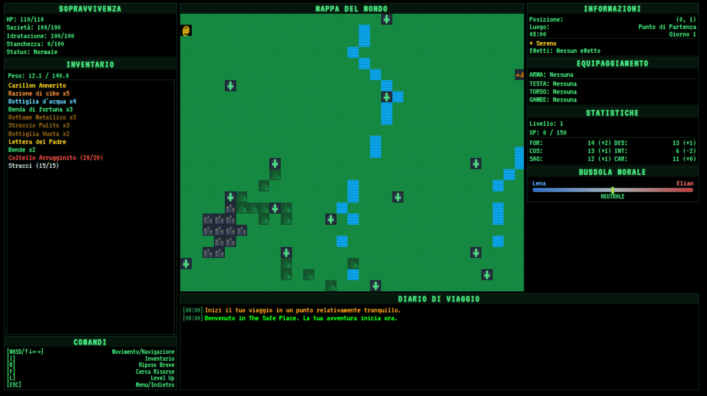

# The Safe Place Chronicles: The Echo of the Journey

*Le lezioni dal passato. Una lotta per il futuro. Un viaggio narrativo di sopravvivenza nel cuore di un mondo in rovina.*



## Cos'è The Safe Place Chronicles?

**The Safe Place Chronicles** è un gioco di ruolo (RPG) narrativo di sopravvivenza che si ispira ai classici testuali degli anni '80. Nato come esperimento tecnico e narrativo, è stato sviluppato in simbiosi creativa con il supporto di modelli linguistici (LLM) per creare un'opera strutturata, coerente e dotata di un'anima.

Il gioco è costruito con una filosofia "keyboard-only" per replicare il feeling autentico di quell'epoca, con un'interfaccia che richiama i vecchi monitor a fosfori verdi. Con la versione 2.0.16 il progetto è completo e giocabile dall'inizio alla fine, rilasciato come applicazione desktop **open source** per Windows, macOS e Linux (React + Ink + Electron).

Questa è la landing page ufficiale del progetto, creata per presentare il concept, la storia dello sviluppo e distribuire il gioco.

## Caratteristiche Principali del Gioco

| Funzionalità | Descrizione |
| :--- | :--- |
| **MONDO VIVO E DINAMICO** | Esplora una vasta mappa con biomi unici (Pianure, Foreste, Città) influenzati da un sistema meteo e temporale dinamico. |
| **SOPRAVVIVENZA IMPEGNATIVA** | Gestisci fame, sete e salute mentre curi stati multipli come Ferite, Malattie e Avvelenamento. |
| **STORIA STRATIFICATA** | Vivi una trama principale in 12 capitoli, svelata organicamente attraverso il gameplay. |
| **CRESCITA E SCELTE MORALI** | Sali di livello e definisci il tuo stile di gioco scegliendo tra Talenti unici. Le tue decisioni morali modelleranno la tua Bussola Interiore. |
| **COMBATTIMENTO TATTICO** | Affronta un combattimento a turni, testuale e narrativo. Spendi un turno per 'Analizzare' il nemico e scoprirne le debolezze. |
| **CRAFTING PROGRESSIVO** | Trova manuali e schemi nel mondo per apprendere come creare oggetti essenziali e trasformare materiali grezzi in strumenti di sopravvivenza. |

## Log Sviluppo Principali

- **v1.3.1 - The Survival Overhaul:** Introduzione della 'Ricerca Attiva' e revisione del loot.
- **v1.5.0 - Quest System Framework:** Implementazione di un'infrastruttura completa per missioni.
- **v1.7.0 - Social Hub & Interactive NPCs:** Il mondo si popola con PNG interattivi e alberi di dialogo.
- **v1.9.1 - Tactical Combat:** Il combattimento si evolve con azioni ambientali contestuali.
- **v1.9.5 - Content Expansion:** Aggiunta di quest, eventi e oggetti unici che arricchiscono la narrativa.
- **v2.0.0 - Golden Master Release:** Il progetto raggiunge la sua forma definitiva; tutti i sistemi stabili e testati.
- **v2.0.14 - Campagna di Chiusura:** Audit completo e revisione dei sistemi; il gioco è completabile fino al finale.
- **v2.0.16 - Rilascio Desktop Open Source:** App desktop Electron per Windows, macOS e Linux, con build via CI e release pubblica su GitHub.

## Come Eseguire il Progetto

Questo repository contiene il codice sorgente della landing page. Per eseguirla in locale:

1.  **Clona il repository:**
    ```bash
    git clone <URL_DEL_REPOSITORY>
    ```
2.  **Installa le dipendenze:**
    ```bash
    npm install
    ```
3.  **Avvia il server di sviluppo:**
    ```bash
    npm run dev
    ```
4.  **Per creare una build di produzione:**
    ```bash
    npm run build
    ```

## Gioca / Scarica

Il gioco è **open source** e scaricabile gratuitamente per Windows, macOS e Linux dalla release pubblica su GitHub:

- **Release e download:** [github.com/Pitz72/TheSafePlace-React/releases](https://github.com/Pitz72/TheSafePlace-React/releases)
- **Codice sorgente:** [github.com/Pitz72/TheSafePlace-React](https://github.com/Pitz72/TheSafePlace-React)