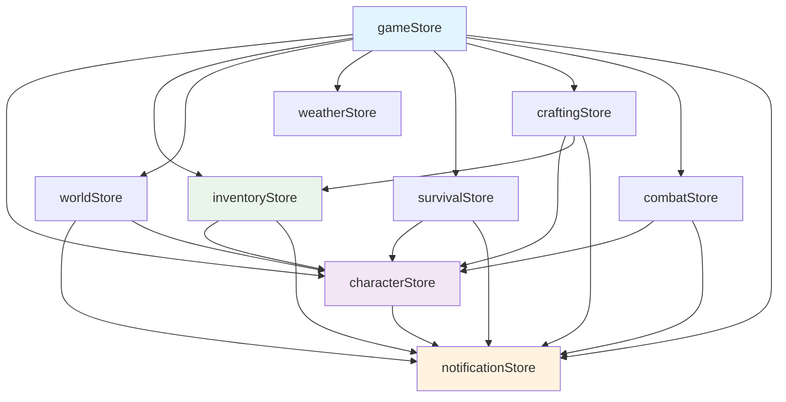
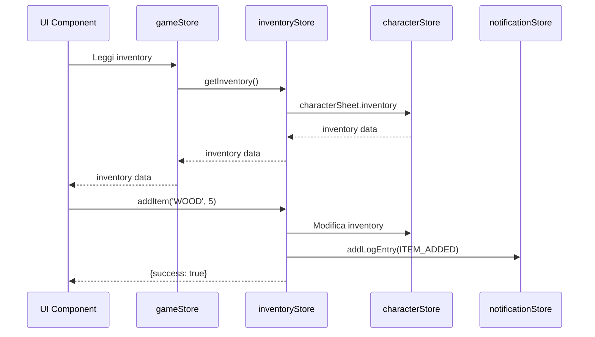

# Contratti e Dipendenze degli Store Zustand

## Panoramica

Questo documento definisce i contratti, le responsabilità e le dipendenze tra gli store Zustand nel progetto TheSafePlace-React. Ogni store ha responsabilità specifiche e pattern di accesso definiti per mantenere la coerenza dei dati.

## Architettura degli Store

### Diagramma delle Dipendenze



## Store Contracts

### 1. gameStore (CoreGameState)

**Responsabilità Primarie:**
- Store principale per la navigazione UI
- Proxy unificato per accedere agli altri store
- Gestione dello stato della schermata corrente
- Coordinamento tra store specializzati

**Contratto:**
```typescript
interface GameStoreContract {
  // Proxy Getters (READ-ONLY)
  characterSheet: ICharacterSheet;  // da characterStore
  inventory: IInventorySlot[];      // da inventoryStore
  items: Record<string, IItem>;     // da inventoryStore
  
  // Navigation State
  currentScreen: ScreenType;
  
  // Coordination Actions
  triggerEvent: (eventId: string) => void;
  handleNightConsumption: () => void;
}
```

**Pattern di Accesso:**
- ✅ **Componenti UI Principali**: Usare gameStore come punto di accesso unificato
- ✅ **Lettura dati**: Tramite getter proxy
- ❌ **Modifiche dirette**: Non modificare dati tramite gameStore, usare store specifici

**Dipendenze:**
- `characterStore` (per characterSheet)
- `inventoryStore` (per inventory e items)
- `worldStore` (per eventi e tempo)
- `notificationStore` (per logging)

---

### 2. characterStore (CharacterState)

**Responsabilità Primarie:**
- Gestione della scheda del personaggio
- Statistiche, HP, esperienza
- Inventario del personaggio (source of truth)
- Controlli di abilità e modificatori

**Contratto:**
```typescript
interface CharacterStoreContract {
  // State
  characterSheet: ICharacterSheet;
  lastShortRestTime: { day: number; time: number } | null;
  
  // Core Actions
  updateHP: (amount: number) => void;           // Con logging automatico
  addExperience: (xpGained: number) => void;    // Con logging automatico
  updateCharacterSheet: (newSheet: ICharacterSheet) => void;
  
  // Utility Actions
  getModifier: (ability: AbilityType) => number;
  performAbilityCheck: (ability: AbilityType, difficulty: number) => CheckResult;
  resetCharacter: () => void;
}
```

**Invarianti:**
- `currentHP` deve essere sempre tra 0 e `maxHP`
- Tutte le modifiche di HP devono essere loggate
- L'inventario in `characterSheet.inventory` è la source of truth

**Dipendenze:**
- `notificationStore` (per logging HP e XP)

---

### 3. inventoryStore (InventoryState)

**Responsabilità Primarie:**
- Logica dell'inventario e gestione oggetti
- Database degli oggetti (items)
- Azioni di inventario (aggiungi, rimuovi, equipaggia)
- Interfaccia per accesso all'inventario del personaggio

**Contratto:**
```typescript
interface InventoryStoreContract {
  // State
  items: Record<string, IItem>;     // Database oggetti (source of truth)
  
  // Core Actions
  addItem: (itemId: string, quantity: number) => ActionResult;
  removeItem: (itemId: string, quantity: number) => ActionResult;
  equipItemFromInventory: (itemId: string) => ActionResult;
  
  // Access Methods
  getInventory: () => IInventorySlot[];         // Accede a characterStore
  getItemById: (itemId: string) => IItem | null;
  
  // Utility
  clearInventory: () => void;
}
```

**Pattern di Accesso:**
- ✅ **Per oggetti**: Usare `inventoryStore.items[itemId]`
- ✅ **Per inventario**: Usare `inventoryStore.getInventory()`
- ❌ **Accesso diretto**: Non accedere a `characterStore.characterSheet.inventory`

**Invarianti:**
- `getInventory()` deve sempre riflettere `characterStore.characterSheet.inventory`
- Tutte le modifiche all'inventario devono essere loggate
- Gli oggetti in `items` sono immutabili

**Dipendenze:**
- `characterStore` (per accesso all'inventario)
- `notificationStore` (per logging operazioni)

---

### 4. worldStore (WorldState)

**Responsabilità Primarie:**
- Gestione del mondo di gioco (mappa, posizione)
- Sistema temporale
- Movimento del giocatore
- Eventi ambientali

**Contratto:**
```typescript
interface WorldStoreContract {
  // State
  mapData: string[][];
  playerPosition: { x: number; y: number };
  timeState: { currentTime: number; day: number; isDay: boolean };
  currentBiome: string | null;
  cameraPosition: { x: number; y: number };
  
  // Core Actions
  loadMap: (mapData: string[][]) => void;
  updatePlayerPosition: (position: { x: number; y: number }) => void;  // Con logging
  advanceTime: (minutes: number) => void;                              // Con logging
  updateCameraPosition: (viewportSize: { width: number; height: number }) => void;
  
  // Utility
  getBiomeKeyFromChar: (char: string) => string;
  formatTime: (timeMinutes: number) => string;
  resetWorld: () => void;
}
```

**Invarianti:**
- Il movimento del giocatore deve essere loggato
- I cambi di tempo significativi (>= 60 min) devono essere loggati
- I cambi di bioma devono essere loggati
- `currentTime` deve essere sempre tra 0 e 1439 (minuti in un giorno)

**Dipendenze:**
- `characterStore` (per danni da fame/sete)
- `notificationStore` (per logging eventi)
- `gameStore` (per trigger eventi)

---

### 5. notificationStore (NotificationState)

**Responsabilità Primarie:**
- Sistema di logging centralizzato
- Gestione messaggi e notifiche
- Storico degli eventi di gioco

**Contratto:**
```typescript
interface NotificationStoreContract {
  // State
  logs: LogEntry[];
  
  // Core Actions
  addLogEntry: (type: MessageType, data?: any) => void;
  clearLogs: () => void;
  
  // Query Methods
  getRecentLogs: (count: number) => LogEntry[];
  getLogsByType: (type: MessageType) => LogEntry[];
}
```

**Pattern di Utilizzo:**
- ✅ **Tutti gli store**: Devono usare `addLogEntry` per eventi critici
- ✅ **Modifiche di stato**: HP, XP, inventario, movimento, tempo
- ✅ **Eventi di gioco**: Combattimento, crafting, eventi casuali

**Invarianti:**
- I log devono essere immutabili una volta creati
- Ogni log deve avere timestamp e tipo
- Non ci sono dipendenze da altri store (è un sink)

**Dipendenze:**
- Nessuna (store terminale)

---

### 6. craftingStore (CraftingState)

**Responsabilità Primarie:**
- Gestione del sistema di crafting
- Ricette e materiali
- Logica di crafting e validazione

**Contratto:**
```typescript
interface CraftingStoreContract {
  // State
  recipes: Recipe[];
  knownRecipeIds: string[];
  
  // Core Actions
  craftItem: (recipeId: string) => CraftingResult;
  learnRecipe: (recipeId: string) => void;
  
  // Query Methods
  getAvailableRecipes: () => Recipe[];
  canCraftRecipe: (recipeId: string) => boolean;
  
  // Sync
  syncWithGameStore: () => void;
}
```

**Dipendenze:**
- `characterStore` (per statistiche e ricette conosciute)
- `inventoryStore` (per materiali e risultati)
- `notificationStore` (per logging crafting)

---

## Pattern di Accesso Standardizzati

### Per Componenti UI Principali
```typescript
// ✅ CORRETTO - Usa gameStore come proxy
const { characterSheet, inventory, items } = useGameStore();
```

### Per Componenti Specializzati
```typescript
// ✅ CORRETTO - Accesso diretto per funzionalità specifiche
const { addItem, removeItem } = useInventoryStore();
const { updateHP, addExperience } = useCharacterStore();
```

### Per Modifiche di Stato
```typescript
// ✅ CORRETTO - Usa sempre lo store specifico
inventoryStore.addItem('CRAFT_WOOD', 5);        // Non gameStore
characterStore.updateHP(-10);                    // Non gameStore
worldStore.updatePlayerPosition({ x: 5, y: 3 }); // Non gameStore
```

## Regole di Sincronizzazione

### 1. Source of Truth
- **Inventario**: `characterStore.characterSheet.inventory`
- **Oggetti**: `inventoryStore.items`
- **HP/XP**: `characterStore.characterSheet`
- **Posizione**: `worldStore.playerPosition`
- **Tempo**: `worldStore.timeState`

### 2. Propagazione delle Modifiche
- Tutte le modifiche devono passare attraverso lo store responsabile
- I proxy in gameStore sono READ-only
- Le modifiche critiche devono essere loggate automaticamente

### 3. Gestione degli Errori
- Ogni azione deve restituire un risultato con `success: boolean`
- Gli errori non devono corrompere lo stato
- Le operazioni fallite devono essere loggate

## Test di Validazione

Per verificare il rispetto dei contratti, eseguire:

```typescript
import { validateStoreSynchronization } from './tests/store-synchronization.test';

const validation = validateStoreSynchronization();
if (!validation.isValid) {
  console.error('Store synchronization issues:', validation.issues);
}
```

## Linee Guida per lo Sviluppo

### DO ✅
- Usare gameStore per lettura nei componenti UI principali
- Usare store specifici per modifiche di stato
- Loggare tutte le modifiche critiche
- Restituire risultati con `success: boolean`
- Mantenere gli invarianti definiti

### DON'T ❌
- Modificare dati tramite gameStore
- Accedere direttamente a `characterStore.characterSheet.inventory`
- Saltare il logging per modifiche critiche
- Creare dipendenze circolari tra store
- Modificare dati di altri store direttamente

## Diagramma di Flusso delle Operazioni



## Versioning e Compatibilità

- **Versione Corrente**: 1.0.0
- **Compatibilità**: Tutti i contratti sono stabili
- **Modifiche Future**: Devono mantenere backward compatibility
- **Deprecazioni**: Devono essere documentate con almeno una versione di preavviso

---

*Ultimo aggiornamento: Gennaio 2025*
*Autore: Sistema di Refactoring Zustand*