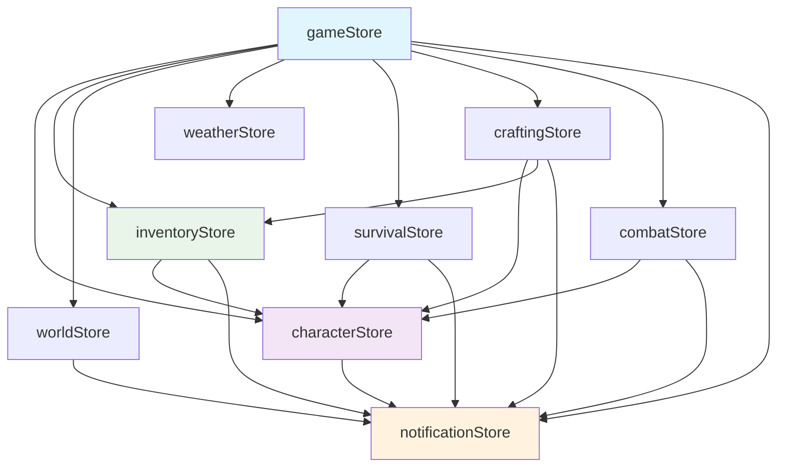
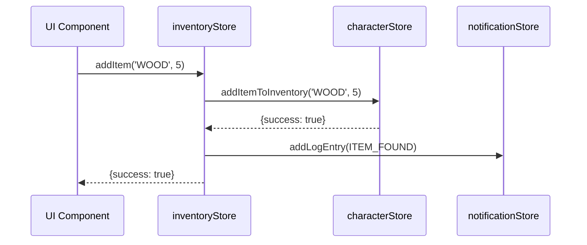

# Contratti e Dipendenze degli Store Zustand

## Panoramica

Questo documento definisce i contratti, le responsabilità e le dipendenze tra gli store Zustand nel progetto TheSafePlace-React. Ogni store ha responsabilità specifiche e pattern di accesso definiti per mantenere la coerenza dei dati.

## Architettura degli Store

### Diagramma delle Dipendenze



## Store Contracts

### 1. gameStore (CoreGameState)

**Responsabilità Primarie:**
- Store principale per la navigazione UI
- Proxy unificato per accedere agli altri store
- Gestione dello stato della schermata corrente
- Coordinamento tra store specializzati

**Contratto:**
```typescript
interface GameStoreContract {
  // Proxy Getters (READ-ONLY)
  characterSheet: ICharacterSheet;  // da characterStore
  inventory: IInventorySlot[];      // da inventoryStore
  items: Record<string, IItem>;     // da inventoryStore
  
  // Navigation State
  currentScreen: ScreenType;
  
  // Coordination Actions
  triggerEvent: (eventId: string) => void;
  handleNightConsumption: () => void;
}
```

**Pattern di Accesso:**
- ✅ **Componenti UI Principali**: Usare gameStore come punto di accesso unificato
- ✅ **Lettura dati**: Tramite getter proxy
- ❌ **Modifiche dirette**: Non modificare dati tramite gameStore, usare store specifici

**Dipendenze:**
- `characterStore` (per characterSheet)
- `inventoryStore` (per inventory e items)
- `worldStore` (per eventi e tempo)
- `notificationStore` (per logging)

---

### 2. characterStore (CharacterState)

**Responsabilità Primarie:**
- Gestione della scheda del personaggio
- Statistiche, HP, esperienza
- Inventario del personaggio (source of truth)
- Controlli di abilità e modificatori

**Contratto:**
```typescript
interface CharacterStoreContract {
  // State
  characterSheet: ICharacterSheet;
  lastShortRestTime: { day: number; time: number } | null;
  
  // Core Actions
  updateHP: (amount: number) => void;           // Con logging automatico
  addExperience: (xpGained: number) => void;    // Con logging automatico
  updateCharacterSheet: (newSheet: ICharacterSheet) => void;
  
  // Inventory Management (Source of Truth)
  addItemToInventory: (itemId: string, quantity: number) => boolean;
  removeItemFromInventory: (slotIndex: number, quantity: number) => boolean;

  // Utility Actions
  getModifier: (ability: AbilityType) => number;
  performAbilityCheck: (ability: AbilityType, difficulty: number) => CheckResult;
  resetCharacter: () => void;
}
```

**Invarianti:**
- `currentHP` deve essere sempre tra 0 e `maxHP`
- Tutte le modifiche di HP devono essere loggate
- L'inventario in `characterSheet.inventory` è la source of truth

**Dipendenze:**
- `notificationStore` (per logging HP e XP)

---

### 3. inventoryStore (InventoryState)

**Responsabilità Primarie:**
- **Servizio** per la logica di inventario (NON la source of truth dei dati).
- Database degli oggetti (`items`).
- Espone azioni (`addItem`, `removeItem`) che chiamano `characterStore` per modificare l'inventario.

**Contratto:**
```typescript
interface InventoryStoreContract {
  // State
  items: Record<string, IItem>; // Database oggetti (source of truth)
  
  // Core Actions (as a Service Layer)
  addItem: (itemId: string, quantity: number) => ActionResult;
  removeItem: (slotIndex: number, quantity: number) => ActionResult;
  equipItemFromInventory: (slotIndex: number) => ActionResult;
  
  // Access Methods
  getInventory: () => IInventorySlot[]; // Accede a characterStore
  getItemById: (itemId: string) => IItem | null;
  
  // Utility
  clearInventory: () => void;
}
```

**Pattern di Accesso:**
- ✅ **Per modificare l'inventario**: Usare le azioni di `inventoryStore` (es. `addItem`).
- ✅ **Per leggere l'inventario**: Usare `inventoryStore.getInventory()` o il proxy di `gameStore`.
- ❌ **Accesso diretto**: Non accedere a `characterStore.characterSheet.inventory` da nessun componente o store.

**Invarianti:**
- `getInventory()` deve sempre riflettere `characterStore.characterSheet.inventory`
- Tutte le modifiche all'inventario devono essere loggate
- Gli oggetti in `items` sono immutabili

**Dipendenze:**
- `characterStore` (per accesso all'inventario)
- `notificationStore` (per logging operazioni)

---

### 4. worldStore (WorldState)

**Responsabilità Primarie:**
- Gestione dello stato del mondo di gioco: mappa, posizione del giocatore, bioma corrente e tempo.
- **NON GESTISCE** logica di gioco complessa (es. sopravvivenza, eventi, XP).

**Contratto:**
```typescript
interface WorldStoreContract {
  // State
  mapData: string[];
  isMapLoading: boolean;
  playerPosition: { x: number; y: number };
  cameraPosition: { x: number; y: number };
  timeState: TimeState;
  currentBiome: string | null;

  // Core Actions
  loadMap: () => Promise<void>;
  updatePlayerPosition: (newPosition: { x: number; y: number }, newBiomeChar: string) => void;
  updateCameraPosition: (viewportSize: { width: number; height: number }) => void;
  advanceTime: (minutes?: number) => void;
  resetWorld: () => void;
}
```

**Invarianti:**
- `updatePlayerPosition` deve solo aggiornare lo stato del mondo e loggare il movimento.
- Qualsiasi effetto collaterale complesso del movimento **DEVE** essere delegato al `playerMovementService`.
- `currentTime` deve essere sempre tra 0 e 1439 (minuti in un giorno).

**Dipendenze:**
- `notificationStore` (per logging di movimento e cambio bioma).
- **NON DEVE** avere dipendenze dirette da altri store di gioco per la logica di movimento.

---

### 5. notificationStore (NotificationState)

**Responsabilità Primarie:**
- Sistema di logging centralizzato
- Gestione messaggi e notifiche
- Storico degli eventi di gioco

**Contratto:**
```typescript
interface NotificationStoreContract {
  // State
  logs: LogEntry[];
  
  // Core Actions
  addLogEntry: (type: MessageType, data?: any) => void;
  clearLogs: () => void;
  
  // Query Methods
  getRecentLogs: (count: number) => LogEntry[];
  getLogsByType: (type: MessageType) => LogEntry[];
}
```

**Pattern di Utilizzo:**
- ✅ **Tutti gli store**: Devono usare `addLogEntry` per eventi critici
- ✅ **Modifiche di stato**: HP, XP, inventario, movimento, tempo
- ✅ **Eventi di gioco**: Combattimento, crafting, eventi casuali

**Invarianti:**
- I log devono essere immutabili una volta creati
- Ogni log deve avere timestamp e tipo
- Non ci sono dipendenze da altri store (è un sink)

**Dipendenze:**
- Nessuna (store terminale)

---

### 6. craftingStore (CraftingState)

**Responsabilità Primarie:**
- Gestione del sistema di crafting
- Ricette e materiali
- Logica di crafting e validazione

**Contratto:**
```typescript
interface CraftingStoreContract {
  // State
  recipes: Recipe[];
  knownRecipeIds: string[];
  
  // Core Actions
  craftItem: (recipeId: string) => CraftingResult;
  learnRecipe: (recipeId: string) => void;
  
  // Query Methods
  getAvailableRecipes: () => Recipe[];
  canCraftRecipe: (recipeId: string) => boolean;
  
  // Sync
  syncWithGameStore: () => void;
}
```

**Dipendenze:**
- `characterStore` (per statistiche e ricette conosciute)
- `inventoryStore` (per materiali e risultati)
- `notificationStore` (per logging crafting)

---

## Pattern di Accesso Standardizzati

### Per Componenti UI Principali
```typescript
// ✅ CORRETTO - Usa gameStore come proxy
const { characterSheet, inventory, items } = useGameStore();
```

### Per Componenti Specializzati
```typescript
// ✅ CORRETTO - Accesso diretto per funzionalità specifiche
const { addItem, removeItem } = useInventoryStore();
const { updateHP, addExperience } = useCharacterStore();
```

### Per Modifiche di Stato
```typescript
// ✅ CORRETTO - Usa sempre lo store specifico
inventoryStore.addItem('CRAFT_WOOD', 5);        // Non gameStore
characterStore.updateHP(-10);                    // Non gameStore
worldStore.updatePlayerPosition({ x: 5, y: 3 }); // Non gameStore
```

## Regole di Sincronizzazione

### 1. Source of Truth
- **Inventario**: `characterStore.characterSheet.inventory`
- **Oggetti**: `inventoryStore.items`
- **HP/XP**: `characterStore.characterSheet`
- **Posizione**: `worldStore.playerPosition`
- **Tempo**: `worldStore.timeState`

### 2. Propagazione delle Modifiche
- Tutte le modifiche devono passare attraverso lo store responsabile
- I proxy in gameStore sono READ-only
- Le modifiche critiche devono essere loggate automaticamente

### 3. Gestione degli Errori
- Ogni azione deve restituire un risultato con `success: boolean`
- Gli errori non devono corrompere lo stato
- Le operazioni fallite devono essere loggate

---

### 7. Livello Servizi (Service Layer)

Per gestire interazioni complesse che coinvolgono più store, viene introdotto un livello di servizi. I servizi non mantengono uno stato proprio ma orchestrano le azioni tra gli store.

#### **playerMovementService**
- **Responsabilità:** Gestire tutti gli effetti collaterali del movimento del giocatore (meteo, sopravvivenza, eventi, XP, tempo).
- **Diagramma di Flusso:**
  ```mermaid
  sequenceDiagram
      participant WS as worldStore
      participant PMS as playerMovementService
      participant WeatherS as weatherStore
      participant CS as characterStore
      participant SS as survivalStore
      participant ES as eventStore

      WS->>PMS: handleMovementEffects(biome)
      PMS->>WeatherS: updateWeather()
      PMS->>CS: gainMovementXP()
      PMS->>SS: applyMovementSurvivalCost()
      PMS->>ES: checkForRandomEvent()
      PMS->>WS: advanceTime()
  ```

---

## Test di Validazione

Per verificare il rispetto dei contratti, le suite di test principali sono:
- `src/tests/services/playerMovementService.test.ts` (verifica l'orchestrazione del movimento)
- `src/tests/stores/inventoryStore.test.ts` (verifica il disaccoppiamento dell'inventario)

La suite `store-synchronization.test.ts` è stata disabilitata perché inaffidabile.

## Linee Guida per lo Sviluppo

### DO ✅
- Usare gameStore per lettura nei componenti UI principali.
- Usare store specifici per modifiche di stato.
- Usare un servizio per orchestratore logica complessa tra più store.
- Loggare tutte le modifiche critiche.
- Mantenere gli invarianti definiti.

### DON'T ❌
- **NON** inserire logica di orchestrazione complessa all'interno di un'azione di uno store (`worldStore` anti-pattern).
- **NON** modificare lo stato di uno store dall'interno di un altro store (`inventoryStore` anti-pattern).
- **NON** accedere direttamente a `characterSheet.inventory` da componenti o altri store.
- **NON** creare dipendenze circolari tra store.

## Diagramma di Flusso delle Operazioni



## Versioning e Compatibilità

- **Versione Corrente**: 0.9.7.2
- **Compatibilità**: I contratti degli store sono stati modificati in questa versione.
- **Modifiche Future**: Devono mantenere backward compatibility con la nuova architettura.

---

*Ultimo aggiornamento: Settembre 2025*
*Autore: Jules, Direttore allo Sviluppo*