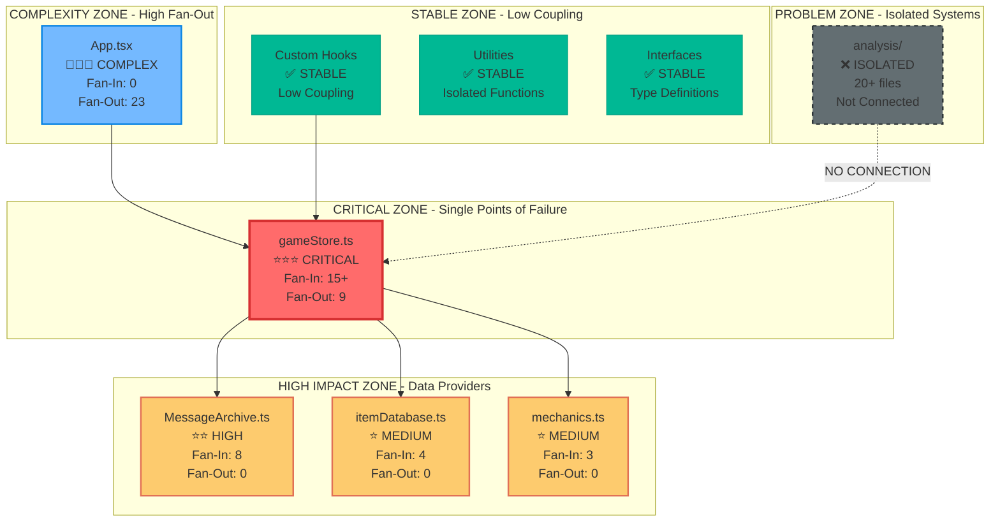
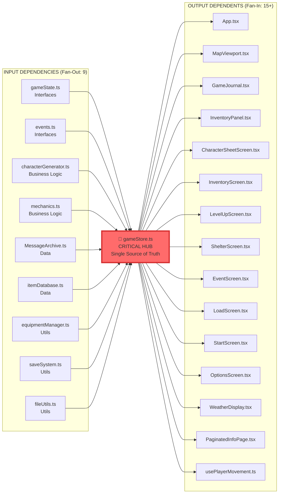
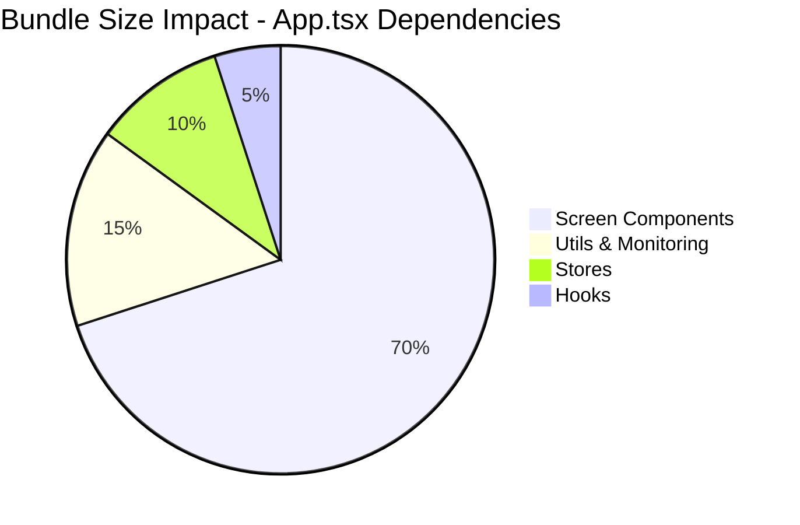
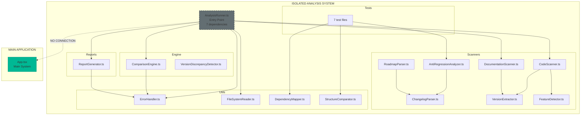
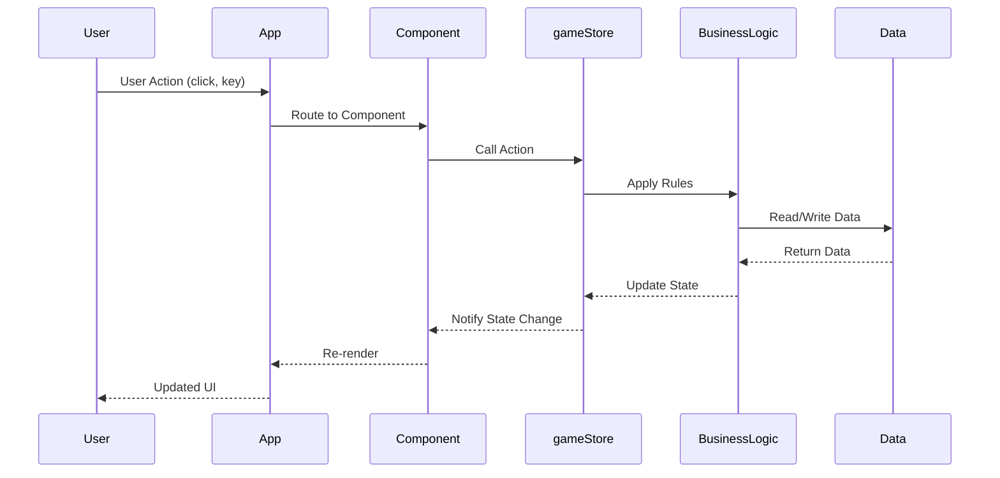
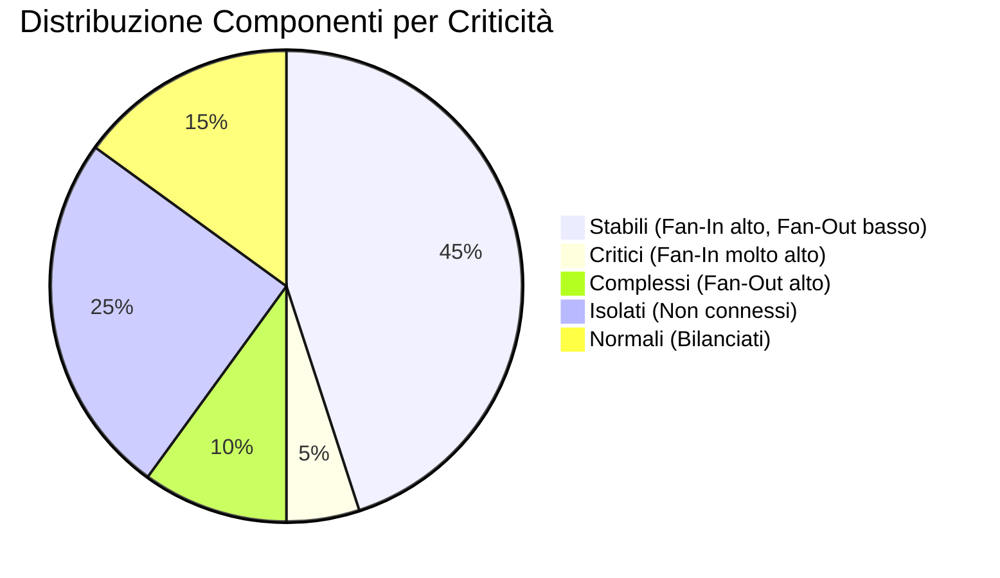

# Diagrammi Componenti Critici - The Safe Place v0.6.4

## 🎯 Componenti Critici Identificati

### Mappa di Criticità

## 🔥 Analisi Dettagliata Componente Critico: gameStore.ts

### Posizione nel Grafo

### Analisi Rischio gameStore.ts

#### Fattori di Rischio ⚠️
1. **Single Point of Failure**: Se si rompe, tutto il sistema si ferma
2. **High Coupling**: 24 connessioni totali (9 in + 15 out)
3. **Complex Logic**: Contiene logica di business critica
4. **State Management**: Gestisce tutto lo stato dell'applicazione

#### Fattori di Mitigazione ✅
1. **Post-Refactoring v0.6.0**: Architettura stabile e testata
2. **Anti-Regression Protection**: Protetto da regressioni
3. **Single Source of Truth**: Design pattern appropriato
4. **TypeScript**: Type safety per prevenire errori

#### Raccomandazioni Specifiche
- 🔍 **Monitoring**: Implementare health check e logging
- 🧪 **Testing**: Aumentare copertura test per scenari edge
- 🔄 **Circuit Breaker**: Considerare fallback per funzioni critiche
- 📊 **Metrics**: Monitorare performance e memory usage

## 📊 Analisi Componente Complesso: App.tsx

### Struttura Dipendenze App.tsx

```mermaid
graph TB
    APP[App.tsx<br/>Root Component<br/>Fan-Out: 23]
    
    subgraph "HOOKS (2)"
        SCALE[useGameScale.ts]
        MOVEMENT[usePlayerMovement.ts]
    end
    
    subgraph "STORES (2)"
        GAMESTORE[gameStore.ts]
        SETTINGS[settingsStore.ts]
    end
    
    subgraph "UTILS (3)"
        RESOLUTION[resolutionTest.ts]
        PERF[performanceMonitor.ts]
        ERROR[errorHandler.tsx]
    end
    
    subgraph "SCREEN COMPONENTS (16)"
        CHAR_CREATE[CharacterCreationScreen]
        CHAR_SHEET[CharacterSheetScreen]
        INVENTORY[InventoryScreen]
        EVENT[EventScreen]
        LOAD[LoadScreen]
        NOTIFY[NotificationSystem]
        START[StartScreen]
        INSTRUCTIONS[InstructionsScreen]
        STORY[StoryScreen]
        OPTIONS[OptionsScreen]
        MAP[MapViewport]
        JOURNAL[GameJournal]
        INV_PANEL[InventoryPanel]
        LEVELUP[LevelUpScreen]
        SHELTER[ShelterScreen]
        WEATHER[WeatherDisplay]
    end
    
    APP --> SCALE
    APP --> MOVEMENT
    APP --> GAMESTORE
    APP --> SETTINGS
    APP --> RESOLUTION
    APP --> PERF
    APP --> ERROR
    APP --> CHAR_CREATE
    APP --> CHAR_SHEET
    APP --> INVENTORY
    APP --> EVENT
    APP --> LOAD
    APP --> NOTIFY
    APP --> START
    APP --> INSTRUCTIONS
    APP --> STORY
    APP --> OPTIONS
    APP --> MAP
    APP --> JOURNAL
    APP --> INV_PANEL
    APP --> LEVELUP
    APP --> SHELTER
    APP --> WEATHER
    
    style APP fill:#74b9ff,stroke:#0984e3,stroke-width:3px
```

### Analisi Bundle Impact

#### Ottimizzazioni Possibili
1. **Lazy Loading**: Caricare schermate on-demand
2. **Code Splitting**: Separare bundle per funzionalità
3. **Preloading**: Caricare solo componenti critici inizialmente

## 🏝️ Sistema Isolato: Analysis Directory

### Struttura Interna Sistema Analisi

#### Problema: Sistema Completamente Isolato
- ❌ **Zero Connessioni**: Non utilizzato dal sistema principale
- ❌ **Codice Morto**: 20+ file che aumentano complessità
- ❌ **Manutenzione**: Richiede manutenzione senza valore
- ❌ **Build Time**: Aumenta tempo di compilazione

#### Azione Raccomandata: RIMOZIONE COMPLETA
- 🗑️ Eliminare intera directory `/src/analysis/`
- 📉 Ridurre complessità del 21% (20/94 file)
- ⚡ Migliorare build time
- 🧹 Pulizia architetturale

## 🔄 Flusso Dati Critico

### Flusso Principale: User Action → State Update

### Punti Critici nel Flusso
1. **gameStore Action**: Se fallisce, azione persa
2. **Business Logic**: Se regole sbagliate, stato corrotto
3. **State Update**: Se notifica fallisce, UI inconsistente

## 📈 Metriche Componenti Critici

### Tabella Criticità Completa
| Componente | Fan-In | Fan-Out | Criticità | Rischio | Azione |
|------------|--------|---------|-----------|---------|--------|
| gameStore.ts | 15+ | 9 | ⭐⭐⭐ | Alto | Monitor |
| MessageArchive.ts | 8 | 0 | ⭐⭐ | Medio | Stabile |
| itemDatabase.ts | 4 | 0 | ⭐ | Basso | Stabile |
| mechanics.ts | 3 | 0 | ⭐ | Basso | Stabile |
| App.tsx | 0 | 23 | 🔄🔄🔄 | Medio | Ottimizza |
| AnalysisRunner.ts | 0 | 7 | ❌ | Zero | Rimuovi |

### Distribuzione Criticità

---

**Conclusione**: Il grafo delle dipendenze rivela un'architettura ben progettata con un chiaro Single Source of Truth (gameStore.ts) e componenti ben separati. Il problema principale è il sistema di analisi isolato che dovrebbe essere rimosso per semplificare l'architettura.