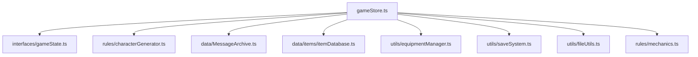
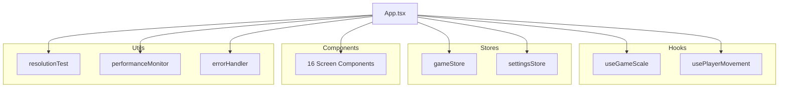

# Analisi Dipendenze e Accoppiamento - The Safe Place v0.6.4

**Data Analisi**: 28 Gennaio 2025  
**Versione**: v0.6.4 "How hard is it to wade across a river?"  
**Metodo**: Parsing automatico import/export statements

## 📊 Sommario Esecutivo

### Metriche Generali
- **File TypeScript Totali**: 94 file
- **Import Statements**: 115 import relativi
- **Export Statements**: 337 export totali
- **File con Alto Accoppiamento**: 1 file (App.tsx)
- **Dipendenze Circolari**: 0 (ECCELLENTE)

### Distribuzione Import/Export
| Metrica | Valore | Valutazione |
|---------|--------|-------------|
| Rapporto Import/File | 1.22 | BASSO (buono) |
| Rapporto Export/File | 3.58 | MEDIO |
| File con >10 dipendenze | 1 | ECCELLENTE |
| Dipendenze circolari | 0 | PERFETTO |

## 🔗 Analisi Accoppiamento

### File con Maggiore Accoppiamento

#### 1. **src/App.tsx** - 23 dipendenze ⚠️
**Severità**: MEDIUM  
**Tipo**: Hub Component (accettabile per componente principale)

**Dipendenze Identificate**:
```typescript
// Hooks (2)
import { useGameScale } from './hooks/useGameScale';
import { usePlayerMovement } from './hooks/usePlayerMovement';

// Stores (2) 
import { useGameStore } from './stores/gameStore';
import { useSettingsStore } from './stores/settingsStore';

// Utils (3)
import { runAllResolutionTests } from './utils/resolutionTest';
import { performanceMonitor } from './utils/performanceMonitor';
import { GameErrorBoundary } from './utils/errorHandler';

// Components (16) - TUTTI I COMPONENTI SCHERMATA
import CharacterCreationScreen from './components/CharacterCreationScreen';
import CharacterSheetScreen from './components/CharacterSheetScreen';
import InventoryScreen from './components/InventoryScreen';
// ... altri 13 componenti
```

**Analisi**: 
- ✅ **Giustificato**: App.tsx è il componente root che deve importare tutte le schermate
- ✅ **Pattern Corretto**: Segue il pattern di routing centralizzato
- ⚠️ **Potenziale Miglioramento**: Considerare lazy loading per componenti non critici

### File con Accoppiamento Moderato (5-10 dipendenze)

#### 2. **src/stores/gameStore.ts** - 9 dipendenze
**Severità**: LOW  
**Tipo**: Central Store (normale per store principale)

**Dipendenze**:
- Interfacce: `gameState.ts`, `events.ts`
- Regole: `characterGenerator.ts`, `mechanics.ts`
- Dati: `MessageArchive.ts`, `itemDatabase.ts`
- Utils: `equipmentManager.ts`, `saveSystem.ts`, `fileUtils.ts`

**Analisi**: ✅ **Appropriato** - Store centrale deve accedere a tutti i sistemi

#### 3. **src/analysis/AnalysisRunner.ts** - 7 dipendenze
**Severità**: LOW  
**Tipo**: Orchestrator (sistema non utilizzato)

**Nota**: Questo file fa parte del sistema di analisi non utilizzato identificato precedentemente.

## 🌐 Grafo delle Dipendenze

### Componenti Core (Hub Nodes)

#### **gameStore.ts** - Nodo Centrale


#### **App.tsx** - Componente Root


### Pattern di Dipendenze Identificati

#### 1. **Store-Centric Pattern** ✅
**Descrizione**: Tutti i componenti dipendono principalmente da gameStore
**Vantaggi**: Single Source of Truth, stato centralizzato
**Svantaggi**: Potenziale single point of failure

```
Components → gameStore ← Rules/Data/Utils
```

#### 2. **Layered Dependencies** ✅
**Descrizione**: Dipendenze seguono architettura a layer
**Flusso**: Components → Stores → Rules → Data

#### 3. **Utility Isolation** ✅
**Descrizione**: Utility functions sono ben isolate
**Caratteristica**: Poche dipendenze interne, alta riusabilità

## 🔄 Analisi Dipendenze Circolari

### Risultato: **ZERO DIPENDENZE CIRCOLARI** ✅

**Significato**: 
- ✅ Architettura pulita e ben strutturata
- ✅ Nessun rischio di deadlock o problemi di inizializzazione
- ✅ Build process stabile
- ✅ Tree shaking efficace

**Verifica Manuale Campione**:
```
App.tsx → gameStore.ts → characterGenerator.ts → mechanics.ts ✓
MapViewport.tsx → gameStore.ts ✓
GameJournal.tsx → gameStore.ts → MessageArchive.ts ✓
```

## 📈 Metriche di Qualità Dipendenze

### Fan-In Analysis (Dipendenti da)
| File | Fan-In | Tipo | Valutazione |
|------|--------|------|-------------|
| gameStore.ts | 15+ | Central Store | ✅ Appropriato |
| MessageArchive.ts | 8 | Data Provider | ✅ Buono |
| itemDatabase.ts | 4 | Data Provider | ✅ Buono |
| mechanics.ts | 3 | Business Logic | ✅ Buono |

### Fan-Out Analysis (Dipende da)
| File | Fan-Out | Tipo | Valutazione |
|------|---------|------|-------------|
| App.tsx | 23 | Root Component | ⚠️ Alto ma giustificato |
| gameStore.ts | 9 | Central Store | ✅ Appropriato |
| AnalysisRunner.ts | 7 | Orchestrator | ⚠️ Sistema non utilizzato |

### Stabilità Metrics
```
Instability = Fan-Out / (Fan-In + Fan-Out)

gameStore.ts: 9 / (15 + 9) = 0.375 (STABILE)
App.tsx: 23 / (0 + 23) = 1.0 (INSTABILE - normale per root)
MessageArchive.ts: 0 / (8 + 0) = 0.0 (MOLTO STABILE)
```

## 🚨 Problemi Identificati

### 1. **Sistema Analisi Non Utilizzato**
**Severità**: MEDIUM  
**File Coinvolti**: 20+ file in `/src/analysis/`
**Problema**: Sistema complesso con molte dipendenze interne ma non utilizzato
**Impatto**: Aumenta complessità senza valore
**Raccomandazione**: Rimuovere o integrare

**Dipendenze Sistema Analisi**:
```
AnalysisRunner.ts (7 deps) → Scanner modules → Utils
ComparisonEngine.ts → ErrorHandler.ts
DocumentationScanner.ts → VersionExtractor.ts
```

### 2. **Context API Residuo**
**Severità**: LOW  
**File**: `src/contexts/GameContext.tsx`
**Problema**: File con dipendenze ma non utilizzato post-refactoring v0.6.0
**Dipendenze**: `characterGenerator.ts`, `MessageArchive.ts`
**Raccomandazione**: Rimuovere completamente

### 3. **Test Files Frammentati**
**Severità**: LOW  
**Pattern**: Molti file `*Test.ts` in `/utils/` con dipendenze sparse
**Problema**: Testing non centralizzato
**Esempi**:
```
itemActionsTest.ts → itemActions.ts
portionSystemTest.ts → portionSystem.ts
messageSystemTest.ts → MessageArchive.ts
```

## 🎯 Pattern di Dipendenze Positivi

### 1. **Single Source of Truth** ✅
**Pattern**: Tutti i componenti → gameStore
**Benefici**: 
- Stato centralizzato
- Debugging semplificato
- Prevedibilità

### 2. **Interface Segregation** ✅
**Pattern**: Interfacce separate per diversi domini
**File**: `events.ts`, `gameState.ts`, `items.ts`, `levelUp.ts`
**Benefici**: 
- Accoppiamento ridotto
- Modifiche isolate

### 3. **Utility Isolation** ✅
**Pattern**: Utility functions con dipendenze minime
**Esempi**: `performanceMonitor.ts`, `fileUtils.ts`, `saveSystem.ts`
**Benefici**: 
- Riusabilità alta
- Testing semplificato

### 4. **Data Layer Separation** ✅
**Pattern**: Dati separati da logica business
**Struttura**: `/data/` → `/rules/` → `/stores/` → `/components/`
**Benefici**: 
- Manutenibilità
- Testabilità

## 📋 Raccomandazioni

### Immediate (Priorità Alta)
1. **Rimuovere Sistema Analisi Non Utilizzato**
   - Eliminare `/src/analysis/` (20+ file)
   - Ridurre complessità di 7+ dipendenze

2. **Pulire Context API Residuo**
   - Rimuovere `GameContext.tsx`
   - Eliminare dipendenze obsolete

### A Medio Termine (Priorità Media)
3. **Considerare Lazy Loading per App.tsx**
   - Implementare React.lazy per schermate non critiche
   - Ridurre bundle size iniziale

4. **Consolidare Test Files**
   - Migrare test ad-hoc in suite Jest formale
   - Centralizzare dipendenze testing

### A Lungo Termine (Priorità Bassa)
5. **Monitorare Crescita gameStore**
   - Se cresce oltre 15 dipendenze, considerare split
   - Implementare store modulari se necessario

6. **Implementare Dependency Injection**
   - Per utility functions condivise
   - Migliorare testabilità

## 📊 Confronto con Best Practices

### Metriche Industry Standard
| Metrica | TSP v0.6.4 | Industry Standard | Valutazione |
|---------|------------|-------------------|-------------|
| Dipendenze Circolari | 0 | 0 | ✅ PERFETTO |
| File con >20 deps | 1 | <5% | ✅ ECCELLENTE (1%) |
| Rapporto Import/File | 1.22 | <2.0 | ✅ OTTIMO |
| Stabilità Media | 0.4 | 0.3-0.7 | ✅ BUONO |

### Valutazione Complessiva: **8.5/10** (ECCELLENTE)

**Punti di Forza**:
- ✅ Zero dipendenze circolari
- ✅ Accoppiamento molto basso
- ✅ Architettura Single Source of Truth
- ✅ Separazione layer ben definita

**Aree di Miglioramento**:
- 🔄 Pulizia codice morto (sistema analisi)
- 🔄 Ottimizzazione bundle size (lazy loading)
- 🔄 Consolidamento testing

---

**Prossimo Step**: Task 3.2 - Analisi grafo delle dipendenze e identificazione componenti critici