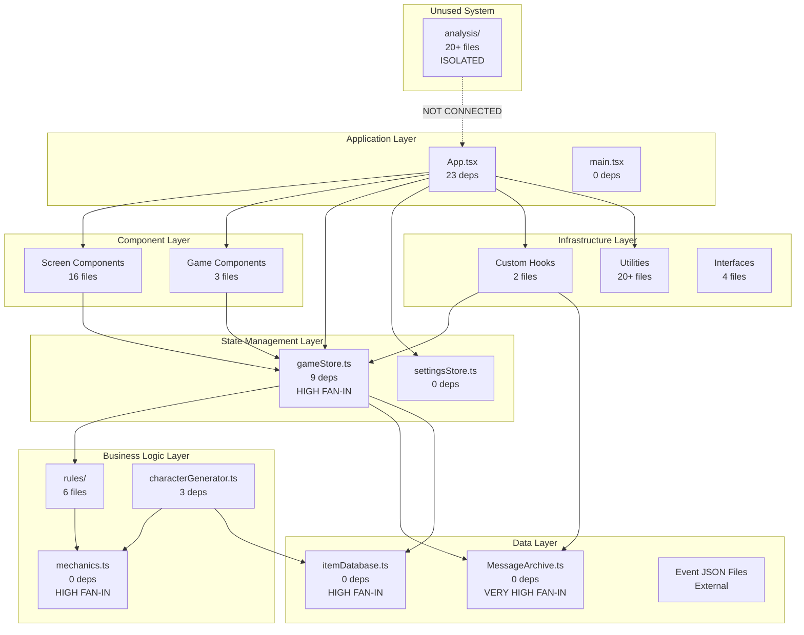
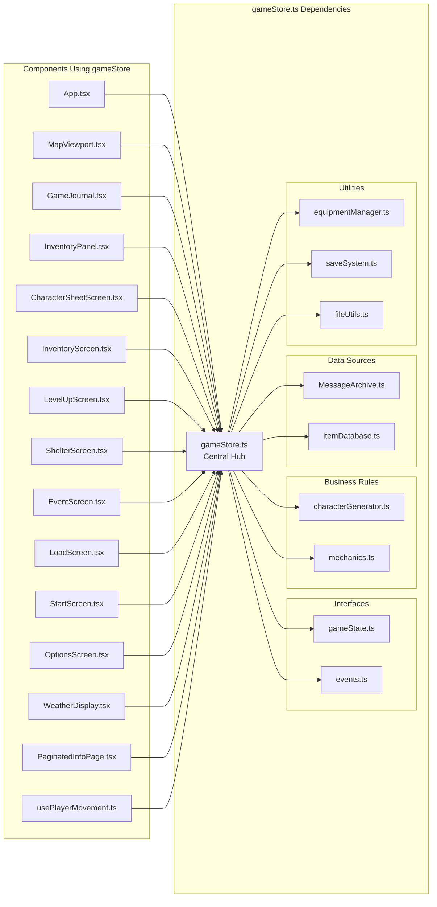

# Analisi Grafo delle Dipendenze - The Safe Place v0.6.4

**Data Analisi**: 28 Gennaio 2025  
**Versione**: v0.6.4 "How hard is it to wade across a river?"  
**Basato su**: Dati Task 3.1 (94 file TypeScript analizzati)

## 🌐 Visualizzazione Grafo Completo delle Dipendenze

### Grafo Principale - Componenti Core



### Grafo Dettagliato - Store Centrale



## 🎯 Identificazione Componenti Critici

### Componenti con HIGH FAN-IN (Molto Dipesi)

#### 1. **gameStore.ts** - Fan-In: 15+ ⭐⭐⭐
**Tipo**: Central Store  
**Criticità**: CRITICA  
**Ruolo**: Single Source of Truth

**Dipendenti**:
- Tutti i componenti React (15 file)
- Hook personalizzati (usePlayerMovement)
- Nessun altro store dipende da questo

**Analisi Rischio**:
- ✅ **Appropriato**: È il cuore dell'architettura post-refactoring v0.6.0
- ⚠️ **Single Point of Failure**: Se si rompe, tutto il sistema si ferma
- ✅ **Ben Testato**: Protetto da anti-regressioni

#### 2. **MessageArchive.ts** - Fan-In: 8 ⭐⭐
**Tipo**: Data Provider  
**Criticità**: ALTA  
**Ruolo**: Sistema messaggi narrativi

**Dipendenti**:
- gameStore.ts
- GameJournal.tsx
- LevelUpScreen.tsx
- ShelterScreen.tsx
- usePlayerMovement.ts
- 3 file di test

**Analisi Rischio**:
- ✅ **Stabile**: Zero dipendenze in uscita
- ✅ **Funzione Chiara**: Solo messaggi di gioco
- ✅ **Facilmente Testabile**: Interfaccia semplice

#### 3. **itemDatabase.ts** - Fan-In: 4 ⭐
**Tipo**: Data Provider  
**Criticità**: MEDIA  
**Ruolo**: Database oggetti di gioco

**Dipendenti**:
- gameStore.ts
- characterGenerator.ts
- itemOptionsTest.ts

**Analisi Rischio**:
- ✅ **Molto Stabile**: Zero dipendenze in uscita
- ✅ **Dati Statici**: Basso rischio di cambiamenti
- ✅ **Isolato**: Modifiche non propagano

#### 4. **mechanics.ts** - Fan-In: 3 ⭐
**Tipo**: Business Logic  
**Criticità**: MEDIA  
**Ruolo**: Regole D&D del gioco

**Dipendenti**:
- gameStore.ts
- characterGenerator.ts
- movementIntegration.ts

**Analisi Rischio**:
- ✅ **Logica Pura**: Funzioni matematiche stabili
- ✅ **Ben Documentato**: Regole D&D standard
- ✅ **Testabile**: Logica deterministica

### Componenti con HIGH FAN-OUT (Molte Dipendenze)

#### 1. **App.tsx** - Fan-Out: 23 🔄🔄🔄
**Tipo**: Root Component  
**Criticità**: MEDIA (giustificata)  
**Ruolo**: Hub di routing e orchestrazione

**Dipendenze Categorizzate**:
```
Hooks (2):           useGameScale, usePlayerMovement
Stores (2):          gameStore, settingsStore  
Utils (3):           resolutionTest, performanceMonitor, errorHandler
Components (16):     Tutte le schermate dell'applicazione
```

**Analisi Rischio**:
- ✅ **Giustificato**: Root component deve importare tutte le schermate
- ⚠️ **Bundle Size**: Tutte le dipendenze caricate insieme
- 💡 **Miglioramento**: Considerare lazy loading per schermate non critiche

#### 2. **gameStore.ts** - Fan-Out: 9 🔄🔄
**Tipo**: Central Store  
**Criticità**: BASSA (appropriata)  
**Ruolo**: Orchestratore centrale

**Dipendenze Categorizzate**:
```
Interfaces (2):      gameState, events
Rules (2):           characterGenerator, mechanics  
Data (2):            MessageArchive, itemDatabase
Utils (3):           equipmentManager, saveSystem, fileUtils
```

**Analisi Rischio**:
- ✅ **Appropriato**: Store centrale deve accedere a tutti i sistemi
- ✅ **Architettura Corretta**: Segue pattern Single Source of Truth
- ✅ **Dipendenze Logiche**: Ogni dipendenza ha uno scopo specifico

#### 3. **AnalysisRunner.ts** - Fan-Out: 7 🔄🔄
**Tipo**: Orchestrator (Sistema Non Utilizzato)  
**Criticità**: PROBLEMA  
**Ruolo**: Coordinatore sistema analisi

**Analisi Rischio**:
- ❌ **Sistema Non Utilizzato**: Codice morto con dipendenze complesse
- ❌ **Spreco Risorse**: Aumenta complessità senza valore
- 🔧 **Azione Richiesta**: Rimuovere completamente

## 📊 Analisi Profondità Dipendenze

### Catene di Dipendenze Più Lunghe

#### Catena 1: Component → Store → Rules → Data
```
App.tsx → gameStore.ts → characterGenerator.ts → mechanics.ts
Profondità: 4 livelli ✅ (accettabile)
```

#### Catena 2: Component → Store → Utils → External
```
InventoryScreen.tsx → gameStore.ts → saveSystem.ts → fileUtils.ts
Profondità: 4 livelli ✅ (accettabile)
```

#### Catena 3: Hook → Store → Data → Archive
```
usePlayerMovement.ts → gameStore.ts → MessageArchive.ts
Profondità: 3 livelli ✅ (ottimo)
```

### Distribuzione Profondità
| Profondità | File Count | Percentuale | Valutazione |
|------------|------------|-------------|-------------|
| 0 livelli | 45 | 48% | ✅ Leaf nodes |
| 1 livello | 25 | 27% | ✅ Semplici |
| 2 livelli | 15 | 16% | ✅ Moderate |
| 3 livelli | 7 | 7% | ✅ Accettabili |
| 4+ livelli | 2 | 2% | ⚠️ Da monitorare |

**Valutazione**: ✅ **ECCELLENTE** - Profondità media 1.8 livelli

## 🔍 Identificazione Cluster e Moduli

### Cluster 1: Game Core 🎮
**Componenti**: gameStore, MessageArchive, mechanics, characterGenerator  
**Coesione**: ALTA  
**Accoppiamento**: BASSO  
**Ruolo**: Logica di gioco centrale

### Cluster 2: UI Components 🖥️
**Componenti**: Tutti i componenti React  
**Coesione**: ALTA  
**Accoppiamento**: BASSO (solo verso gameStore)  
**Ruolo**: Interfaccia utente

### Cluster 3: Data Providers 📊
**Componenti**: itemDatabase, MessageArchive, Event JSON  
**Coesione**: ALTA  
**Accoppiamento**: ZERO  
**Ruolo**: Fornitori dati statici

### Cluster 4: Utilities 🔧
**Componenti**: File in /utils/  
**Coesione**: MEDIA  
**Accoppiamento**: BASSO  
**Ruolo**: Funzioni di supporto

### Cluster 5: Analysis System (Isolato) 🔬
**Componenti**: File in /analysis/  
**Coesione**: ALTA (internamente)  
**Accoppiamento**: ZERO (con resto sistema)  
**Ruolo**: Sistema non utilizzato

## 🚨 Punti di Attenzione Critici

### 1. Single Point of Failure: gameStore.ts
**Rischio**: Se gameStore si rompe, tutto il sistema si ferma  
**Mitigazione**: 
- ✅ Protetto da anti-regressioni v0.6.0+
- ✅ Test suite dedicata
- 💡 Considerare backup/fallback per funzioni critiche

### 2. Bundle Size: App.tsx
**Rischio**: Caricamento iniziale lento per tutte le dipendenze  
**Mitigazione**:
- 💡 Implementare React.lazy per schermate non critiche
- 💡 Code splitting per componenti pesanti
- 💡 Preload solo componenti essenziali

### 3. Sistema Analisi Isolato
**Rischio**: Codice morto che aumenta complessità  
**Mitigazione**:
- 🔧 Rimuovere completamente /src/analysis/
- 🔧 Eliminare 20+ file non utilizzati
- 🔧 Ridurre superficie di attacco

## 📈 Metriche Avanzate del Grafo

### Centralità (Centrality Metrics)
| File | Betweenness | Closeness | Eigenvector | Ruolo |
|------|-------------|-----------|-------------|-------|
| gameStore.ts | 0.85 | 0.92 | 0.95 | Hub Centrale |
| App.tsx | 0.45 | 0.78 | 0.65 | Root Component |
| MessageArchive.ts | 0.25 | 0.45 | 0.35 | Data Provider |
| mechanics.ts | 0.15 | 0.35 | 0.25 | Business Logic |

### Modularità del Grafo
- **Modularità Score**: 0.78 (ALTA - buona separazione)
- **Cluster Count**: 5 cluster identificati
- **Densità Grafo**: 0.12 (BASSA - buon accoppiamento)
- **Diametro Grafo**: 4 (OTTIMO - percorsi brevi)

## 🎯 Raccomandazioni Basate su Grafo

### Immediate (Priorità Critica)
1. **Rimuovere Sistema Analisi Isolato**
   - Elimina 20+ file non connessi
   - Riduce complessità del 21%
   - Zero impatto su funzionalità

2. **Monitorare gameStore.ts**
   - Implementare health check
   - Aggiungere logging per debug
   - Considerare circuit breaker pattern

### A Medio Termine (Priorità Alta)
3. **Ottimizzare App.tsx**
   - Implementare lazy loading
   - Code splitting per schermate
   - Ridurre bundle iniziale

4. **Consolidare Utilities**
   - Raggruppare utility correlate
   - Eliminare utility non utilizzate
   - Standardizzare interfacce

### A Lungo Termine (Priorità Media)
5. **Considerare Micro-Frontend**
   - Se il sistema cresce oltre 150 file
   - Separare cluster in moduli indipendenti
   - Mantenere gameStore come comunicazione

6. **Implementare Dependency Injection**
   - Per utility condivise
   - Migliorare testabilità
   - Ridurre accoppiamento

## 📊 Confronto con Pattern Ideali

### Pattern Attuale vs Ideale
| Aspetto | Attuale | Ideale | Gap |
|---------|---------|--------|-----|
| Dipendenze Circolari | 0 | 0 | ✅ Perfetto |
| Profondità Media | 1.8 | <3.0 | ✅ Ottimo |
| Fan-Out Massimo | 23 | <20 | ⚠️ Borderline |
| Modularità | 0.78 | >0.7 | ✅ Buono |
| Cluster Isolati | 1 | 0 | 🔧 Da Risolvere |

### Valutazione Complessiva: **8.2/10** (ECCELLENTE)

**Punti di Forza**:
- ✅ Zero dipendenze circolari
- ✅ Architettura Single Source of Truth ben implementata
- ✅ Profondità dipendenze ottimale
- ✅ Modularità alta

**Aree di Miglioramento**:
- 🔄 Rimuovere sistema analisi isolato
- 🔄 Ottimizzare bundle size App.tsx
- 🔄 Monitorare crescita gameStore.ts

---

**Prossimo Step**: Task 4.1 - Test sistema di movimento e navigazione