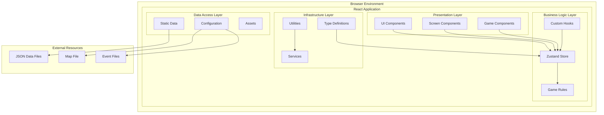
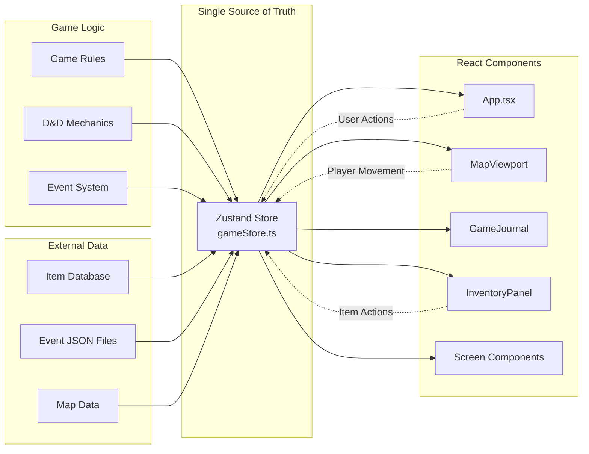
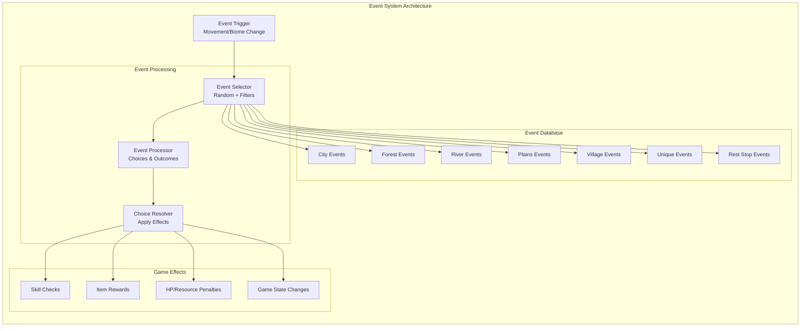
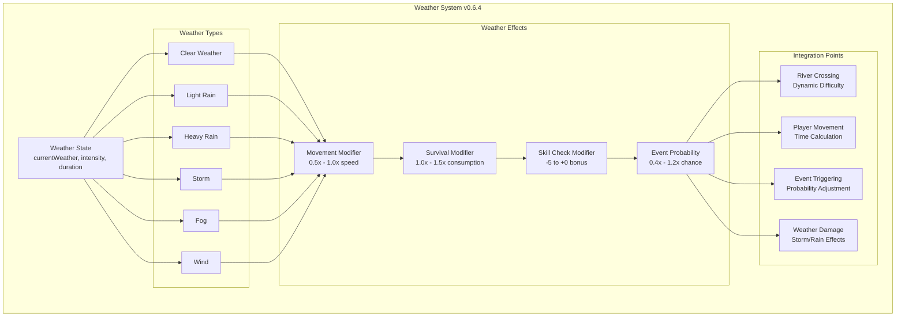
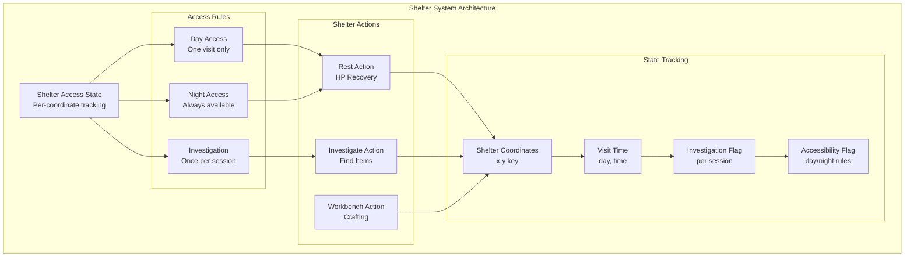
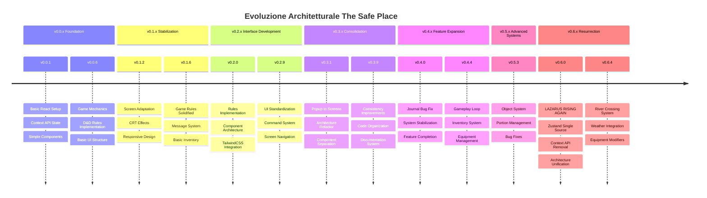

# Diagrammi Architetturali - The Safe Place v0.6.4

## 🏗️ Architettura Generale del Sistema

## 🔄 Flusso Dati Centralizzato (Post v0.6.0)

## 🏛️ Struttura Directory Architetturale

```mermaid
graph TD
    ROOT[The Safe Place Root]
    
    subgraph "Source Code"
        SRC[src/]
        COMPONENTS[components/]
        STORES[stores/]
        RULES[rules/]
        DATA[data/]
        HOOKS[hooks/]
        UTILS[utils/]
        INTERFACES[interfaces/]
        STYLES[styles/]
    end
    
    subgraph "Static Assets"
        PUBLIC[public/]
        EVENTS[events/]
        MAPFILE[map.txt]
        LOGOS[logos/]
    end
    
    subgraph "Documentation"
        DOCS[documentazione/]
        ANTIREG[anti-regressione/]
        CHANGELOG[changelog/]
        DSAR[dsar/]
        ANALISI[analisi/]
    end
    
    subgraph "Configuration"
        CONFIG[Config Files]
        PACKAGE[package.json]
        TSCONFIG[tsconfig.json]
        VITE[vite.config.ts]
        TAILWIND[tailwind.config.js]
    end
    
    ROOT --> SRC
    ROOT --> PUBLIC
    ROOT --> DOCS
    ROOT --> CONFIG
    
    SRC --> COMPONENTS
    SRC --> STORES
    SRC --> RULES
    SRC --> DATA
    SRC --> HOOKS
    SRC --> UTILS
    SRC --> INTERFACES
    SRC --> STYLES
    
    PUBLIC --> EVENTS
    PUBLIC --> MAPFILE
    PUBLIC --> LOGOS
    
    DOCS --> ANTIREG
    DOCS --> CHANGELOG
    DOCS --> DSAR
    DOCS --> ANALISI
```

## 🎮 Architettura Componenti di Gioco

```mermaid
graph TB
    subgraph "Game Screen Architecture"
        APP[App.tsx<br/>Main Container]
        
        subgraph "Left Panel"
            SURVIVAL[Survival Stats]
            INVPANEL[Inventory Panel]
        end
        
        subgraph "Center Panel"
            MAPVIEW[Map Viewport]
            PLAYER[Player Character @]
        end
        
        subgraph "Right Panel"
            INFO[Game Information]
            WEATHER[Weather Display]
            STATS[Character Stats]
            COMMANDS[Command Help]
        end
        
        subgraph "Bottom Panel"
            JOURNAL[Game Journal<br/>Fixed Height 280px]
        end
    end
    
    subgraph "Full Screen Components"
        START[Start Screen]
        CHAR[Character Creation]
        INVENTORY[Inventory Screen]
        LEVELUP[Level Up Screen]
        SHELTER[Shelter Screen]
        EVENT[Event Screen]
        LOAD[Load Screen]
    end
    
    APP --> SURVIVAL
    APP --> INVPANEL
    APP --> MAPVIEW
    APP --> INFO
    APP --> WEATHER
    APP --> STATS
    APP --> COMMANDS
    APP --> JOURNAL
    
    APP -.->|Screen Navigation| START
    APP -.->|Screen Navigation| CHAR
    APP -.->|Screen Navigation| INVENTORY
    APP -.->|Screen Navigation| LEVELUP
    APP -.->|Screen Navigation| SHELTER
    APP -.->|Screen Navigation| EVENT
    APP -.->|Screen Navigation| LOAD
```

## 🔧 Architettura State Management

```mermaid
graph TB
    subgraph "Zustand Store Architecture"
        GAMESTORE[gameStore.ts<br/>Main Game State]
        SETTINGSSTORE[settingsStore.ts<br/>User Settings]
    end
    
    subgraph "Game State Sections"
        MAPSTATE[Map State<br/>mapData, playerPosition]
        CHARSTATE[Character State<br/>characterSheet, survivalState]
        UISTATE[UI State<br/>currentScreen, selectedIndex]
        TIMESTATE[Time State<br/>currentTime, day, isDay]
        WEATHERSTATE[Weather State<br/>currentWeather, effects]
        SHELTERSTATE[Shelter State<br/>shelterAccessState]
        EVENTSTATE[Event State<br/>currentEvent, seenEvents]
        NOTIFICATIONS[Notification State<br/>notifications array]
    end
    
    subgraph "Actions & Logic"
        GAMEACTIONS[Game Actions<br/>initializeGame, updatePosition]
        CHARACTIONS[Character Actions<br/>updateHP, levelUp]
        UIACTIONS[UI Actions<br/>setScreen, navigation]
        SAVEACTIONS[Save Actions<br/>saveGame, loadGame]
        EVENTACTIONS[Event Actions<br/>triggerEvent, resolveChoice]
    end
    
    GAMESTORE --> MAPSTATE
    GAMESTORE --> CHARSTATE
    GAMESTORE --> UISTATE
    GAMESTORE --> TIMESTATE
    GAMESTORE --> WEATHERSTATE
    GAMESTORE --> SHELTERSTATE
    GAMESTORE --> EVENTSTATE
    GAMESTORE --> NOTIFICATIONS
    
    GAMESTORE --> GAMEACTIONS
    GAMESTORE --> CHARACTIONS
    GAMESTORE --> UIACTIONS
    GAMESTORE --> SAVEACTIONS
    GAMESTORE --> EVENTACTIONS
```

## 🎯 Architettura Sistema Eventi

## 🌦️ Architettura Sistema Meteo (v0.6.4)

## 🏠 Architettura Sistema Rifugi (v0.6.1+)

## 🔄 Evoluzione Architetturale (v0.0.1 → v0.6.4)

---

## 📋 Legenda Diagrammi

### Simboli Utilizzati
- **Rettangoli**: Componenti/Moduli
- **Rombi**: Punti di Decisione
- **Cerchi**: Dati/Stato
- **Frecce Solide**: Flusso Dati Diretto
- **Frecce Tratteggiate**: Interazioni/Eventi
- **Subgraph**: Raggruppamenti Logici

### Colori Semantici
- **Blu**: Componenti UI
- **Verde**: Logica Business
- **Arancione**: Dati/Configurazione
- **Rosso**: Problemi/Criticità
- **Grigio**: Infrastruttura

---

**Nota**: Questi diagrammi rappresentano l'architettura attuale post-refactoring v0.6.0. L'architettura precedente (Context API + Zustand) è stata completamente sostituita dal sistema unificato Zustand.